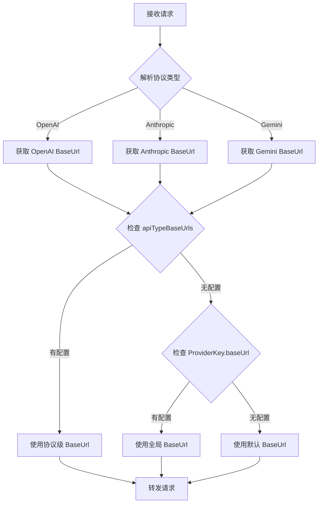

# 模型协议级别 BaseUrl 配置方案

## 实施状态：✅ 已完成

所有代码改动已完成，迁移文件已生成。执行 `pnpm db:migrate:dev` 应用数据库迁移后即可使用。

---

## 实施清单

| 阶段 | 任务 | 状态 | 文件 |
|-----|------|------|------|
| Phase 1 | 修改 Prisma Schema | ✅ 已完成 | `apps/api/prisma/schema.prisma` |
| Phase 1 | 生成数据库迁移 | ✅ 已完成 | `apps/api/prisma/migrations/20260223014739_add_api_type_base_urls/` |
| Phase 2 | 添加 ApiTypeBaseUrlConfigSchema | ✅ 已完成 | `packages/contracts/src/schemas/model-api-type-support.schema.ts` |
| Phase 2 | 更新协议配置 Schema | ✅ 已完成 | `packages/contracts/src/schemas/model.schema.ts` |
| Phase 3 | 更新 AvailableModelService | ✅ 已完成 | `apps/api/src/modules/bot-api/services/available-model.service.ts` |
| Phase 3 | 更新 ProtocolRouterService | ✅ 已完成 | `apps/api/src/modules/proxy/services/protocol-router.service.ts` |
| Phase 4 | 更新 ModelProtocolConfigDialog | ✅ 已完成 | `apps/web/.../model-protocol-config-dialog.tsx` |
| Phase 4 | 更新 ProviderDetailPanel | ✅ 已完成 | `apps/web/.../provider-detail-panel.tsx` |
| Phase 5 | 生成 Prisma Client | ✅ 已完成 | - |
| Phase 5 | 构建验证 | ✅ 已完成 | contracts + api + web 构建成功 |
| Phase 5 | 修复循环引用 | ✅ 已完成 | 将导入移到文件顶部 |
| Phase 5 | UI 优化 | ✅ 已完成 | 自动预填充 + 必填验证 |

---

## UI 优化功能

### 自动预填充

当 ProviderKey 已配置全局 `baseUrl` 时：
1. **加载时**：自动将全局 baseUrl 预填充到所有已启用协议的输入框
2. **勾选协议时**：自动预填充全局 baseUrl 到新勾选的协议

### 验证与状态指示

1. **默认状态**（使用全局 baseUrl）：显示"默认"标签
2. **自定义状态**（有自定义 URL）：显示绿色 Globe 图标
3. **缺失状态**（无任何 baseUrl）：输入框边框红色 + 红色警告图标
4. **提交验证**：选中的协议必须配置 baseUrl 才能提交

---

## 概述

本方案设计用于在"模型协议配置弹框"中为不同协议设置不同的 baseUrl。当用户勾选多个协议时，可以为每个协议配置独立的 API 端点地址。

### 背景与需求

当前系统架构中：
- `ProviderKey.baseUrl` 是全局配置，所有协议共用
- 某些 Provider 支持多协议（如智谱、月之暗面同时支持 OpenAI 和 Anthropic 协议）
- 不同协议可能需要使用不同的 API 端点

**需求示例**：
- OpenAI 协议使用：`https://api.custom-openai.com/v1`
- Anthropic 协议使用：`https://api.custom-anthropic.com`

### 设计原则

1. **向后兼容**：baseUrl 可选，未配置时使用 ProviderKey 的全局 baseUrl
2. **最小改动**：复用现有代码模式，遵循项目架构规范
3. **Zod-first**：所有 API 使用 Zod Schema 验证
4. **4层架构**：严格遵循 API Layer → Service Layer → DB Layer 的分层原则

---

## 已实施的代码改动

### 1. 数据模型修改

**文件**: `apps/api/prisma/schema.prisma`

在 `ModelAvailability` 表中添加了新字段：

```prisma
// ============ 协议级别 BaseUrl 配置 ============
/// 按协议类型配置的 BaseUrl
/// JSON 格式：{ "openai": "https://...", "anthropic": "https://..." }
/// 未配置的协议使用 ProviderKey.baseUrl
apiTypeBaseUrls   Json?    @map("api_type_base_urls") @db.JsonB
```

**迁移文件**: `apps/api/prisma/migrations/20260223014739_add_api_type_base_urls/migration.sql`

```sql
ALTER TABLE "b_model_availability" ADD COLUMN "api_type_base_urls" JSONB;
```

---

### 2. Zod Schema 修改

**文件**: `packages/contracts/src/schemas/model-api-type-support.schema.ts`

添加了协议级别 BaseUrl 配置 Schema：

```typescript
/**
 * 协议类型的 BaseUrl 配置
 * 键为协议类型，值为 BaseUrl 字符串或 null
 * 示例：{ "openai": "https://api.custom.com/v1", "anthropic": "https://api.anthropic.com" }
 */
export const ApiTypeBaseUrlConfigSchema = z.record(
  z.string(), // 键为协议类型字符串
  z.string().url('无效的 URL 格式').nullable(), // 值为 URL 字符串或 null
);

export type ApiTypeBaseUrlConfig = z.infer<typeof ApiTypeBaseUrlConfigSchema>;
```

**文件**: `packages/contracts/src/schemas/model.schema.ts`

更新了以下 Schema：
- `ModelProtocolConfigItemSchema` - 添加 `apiTypeBaseUrls` 字段
- `UpdateModelProtocolConfigInputSchema` - 添加 `apiTypeBaseUrls` 参数
- `BatchUpdateModelProtocolConfigInputSchema` - 添加 `apiTypeBaseUrls` 参数

---

### 3. 后端服务修改

**文件**: `apps/api/src/modules/bot-api/services/available-model.service.ts`

1. **更新 `getProviderModelProtocolConfig`** - 返回 `apiTypeBaseUrls` 字段
2. **更新 `updateModelProtocolConfig`** - 支持 `apiTypeBaseUrls` 参数
3. **更新 `batchUpdateModelProtocolConfig`** - 支持批量更新 `apiTypeBaseUrls`
4. **新增 `getModelApiTypeBaseUrl`** - 获取协议级别 BaseUrl 的辅助方法

```typescript
/**
 * 获取模型指定协议的 BaseUrl
 *
 * 优先级：
 * 1. ModelAvailability.apiTypeBaseUrls[apiType]
 * 2. ProviderKey.baseUrl
 * 3. 返回 null（由调用方决定默认值）
 */
async getModelApiTypeBaseUrl(
  modelAvailabilityId: string,
  apiType: 'openai' | 'anthropic' | 'gemini',
): Promise<string | null>
```

**文件**: `apps/api/src/modules/proxy/services/protocol-router.service.ts`

1. **注入 `ModelAvailabilityService`**
2. **更新 `getProviderKeyForModel`** - 返回 `modelAvailabilityId`
3. **更新 `handleAnthropicRequest`** - 使用协议级别 BaseUrl
4. **新增 `getProtocolSpecificBaseUrl`** - 获取协议级别 BaseUrl

```typescript
// 获取协议级别的 BaseUrl（优先级：协议级 > 全局 > 默认）
let baseUrl: string | null = null;

// 优先使用协议级别配置
if (providerKey.modelAvailabilityId) {
  baseUrl = await this.getProtocolSpecificBaseUrl(
    providerKey.modelAvailabilityId,
    'anthropic',
  );
}

// 回退到全局配置
if (!baseUrl) {
  baseUrl = providerKey.baseUrl || this.getAnthropicBaseUrl(providerVendor);
}
```

---

### 4. 前端组件修改

**文件**: `apps/web/app/[locale]/(main)/secrets/components/model-protocol-config-dialog.tsx`

1. **更新接口定义** - 添加 `apiTypeBaseUrls` 和 `globalBaseUrl`
2. **添加处理函数** - `handleApiTypeBaseUrlChange`
3. **添加 UI** - 协议级别 BaseUrl 输入框

```tsx
{/* 自定义协议 BaseUrl 配置 */}
{model.supportedApiTypes.map((apiType) => (
  <div key={`url-${apiType}`} className="flex items-center gap-2 ml-6">
    <Badge variant="outline" className="text-xs min-w-16">
      {API_TYPE_LABELS[apiType]}
    </Badge>
    <Input
      placeholder={globalBaseUrl || `输入 ${API_TYPE_LABELS[apiType]} 协议的 BaseUrl`}
      value={model.apiTypeBaseUrls?.[apiType] ?? ''}
      onChange={(e) => handleApiTypeBaseUrlChange(model.modelId, apiType, e.target.value)}
      className="h-7 text-xs flex-1"
    />
    {hasCustomUrl && <Globe className="size-3 text-green-500" />}
  </div>
))}
```

**文件**: `apps/web/app/[locale]/(main)/secrets/components/provider-detail-panel.tsx`

传递 `globalBaseUrl` 参数给 `ModelProtocolConfigDialog`：

```tsx
<ModelProtocolConfigDialog
  ...
  globalBaseUrl={existingKeys[0].baseUrl}
  ...
/>
```

---

## BaseUrl 解析优先级

```
1. ModelAvailability.apiTypeBaseUrls[apiType]  ← 协议级别（最高优先级）
2. ProviderKey.baseUrl                          ← 全局配置
3. 默认协议 BaseUrl                             ← 系统默认
```

---

## 使用方式

### 前端 UI

1. 打开 Provider 管理页面
2. 点击"协议配置"按钮打开弹框
3. 对于每个支持的协议，可以输入自定义 BaseUrl
4. 留空则使用 ProviderKey 的全局 baseUrl
5. 点击保存

### API 调用

```typescript
// 批量更新协议配置
POST /api/model/protocol-config/batch
{
  "providerKeyId": "uuid",
  "models": [
    {
      "modelId": "uuid",
      "supportedApiTypes": ["openai", "anthropic"],
      "preferredApiType": "anthropic",
      "apiTypeBaseUrls": {
        "openai": "https://api.custom-openai.com/v1",
        "anthropic": "https://api.custom-anthropic.com"
      }
    }
  ]
}
```

---

## 后续步骤

### 应用数据库迁移

```bash
cd apps/api
pnpm db:migrate:dev
```

### 测试验证

1. 在前端配置协议级别 BaseUrl
2. 发送请求验证路由使用正确的 BaseUrl
3. 检查日志确认 BaseUrl 解析优先级正确

---

## 附录：原始设计方案

<details>
<summary>点击展开完整设计方案</summary>

### 1. 数据模型设计（原始方案）

在 `ModelAvailability` 表中新增 `apiTypeBaseUrls` 字段（JSONB 类型），用于存储按协议类型配置的 BaseUrl：

```json
{
  "openai": "https://api.custom-openai.com/v1",
  "anthropic": "https://api.custom-anthropic.com"
}
```

### 2. 路由流程设计



</details>
